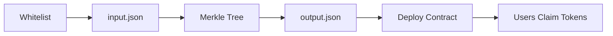

# 🪂 Merkle Airdrop Protocol

<div align="center">


**A gas-efficient, secure token airdrop system using Merkle Trees and EIP-712 signatures**

[Features](#-features) • [Installation](#-installation) • [Usage](#-usage) • [Security](#-security) • [FAQ](#-faq)

</div>

---

## 📋 Table of Contents

- [Overview](#-overview)
- [Features](#-features)
- [Architecture](#-architecture)
- [Installation](#-installation)
- [Quick Start](#-quick-start)
- [Detailed Usage](#-detailed-usage)
- [How It Works](#-how-it-works)
- [Generating Signatures](#-generating-signatures)
- [Testing](#-testing)
- [Security](#-security)
- [FAQ](#-faq)
- [Contributing](#-contributing)
- [License](#-license)

---

## 🎯 Overview

This project implements a **claim-based airdrop system** that uses Merkle Trees for efficient verification and EIP-712 signatures for security. Instead of distributing tokens automatically, eligible users claim their tokens on-demand, significantly reducing gas costs and improving security.

### ⚠️ Important: How Token Distribution Works

**Tokens are NOT distributed automatically after deployment!**

- ✅ After deployment, tokens are held in the `MerkleAirdrop` contract
- ✅ Each participant must **call the `claim()` function** themselves
- ✅ Claims require a valid Merkle proof and EIP-712 signature
- ✅ Tokens are transferred only after successful claim verification

---

## ✨ Features

- 🌳 **Merkle Tree Verification** - Gas-efficient proof validation
- 🔐 **EIP-712 Signatures** - Protection against front-running attacks
- 🛡️ **Double-Claim Prevention** - Built-in mapping to prevent duplicate claims
- 💰 **Gas Optimized** - Only stores Merkle root on-chain
- 🔒 **SafeERC20** - Secure token transfers using OpenZeppelin
- 📝 **Fully Tested** - Comprehensive test coverage with Foundry
- 🎨 **Clean Architecture** - Well-structured, maintainable code

---

## 🏗️ Architecture

### Smart Contracts

```
src/
├── MerkleAirdrop.sol    # Main airdrop distribution contract
└── ZeroToken.sol        # ERC20 token for distribution
```

### Scripts Pipeline

```
script/
├── 1. GenerateInput.s.sol      # Create whitelist (input.json)
├── 2. MakeMerkle.s.sol         # Generate Merkle Tree (output.json)
├── 3. DeployMerkleAirdrop.s.sol # Deploy contracts
└── 4. Interactions.s.sol        # Example claim transaction
```

### Data Flow



---

## 📦 Installation

### Prerequisites

- [Foundry](https://book.getfoundry.sh/getting-started/installation)
- [Git](https://git-scm.com/)

### Setup

```bash
# Clone the repository
git clone https://github.com/yourusername/merkle-airdrop
cd merkle-airdrop

# Install dependencies
forge install

# Install required libraries
forge install OpenZeppelin/openzeppelin-contracts
forge install dmfxyz/murky
forge install Cyfrin/foundry-devops
```

### Environment Configuration

Create a `.env` file:

```bash
# Network RPCs
SEPOLIA_RPC_URL=https://eth-sepolia.g.alchemy.com/v2/YOUR_KEY
MAINNET_RPC_URL=https://eth-mainnet.g.alchemy.com/v2/YOUR_KEY

# Private Keys (NEVER commit these!)
PRIVATE_KEY=0x...
DEPLOYER_KEY=0x...

# Etherscan API (for verification)
ETHERSCAN_API_KEY=YOUR_API_KEY
```

**Add `.env` to your `.gitignore`!**

---

## 🚀 Quick Start

### Complete Workflow (5 Steps)

```bash
# Step 1: Generate whitelist
forge script script/GenerateInput.s.sol

# Step 2: Generate Merkle Tree
forge script script/MakeMerkle.s.sol

# Step 3: Update Merkle root in deployment script
# (Copy root from output.json)

# Step 4: Deploy contracts
forge script script/DeployMerkleAirdrop.s.sol \
  --rpc-url $SEPOLIA_RPC_URL \
  --private-key $PRIVATE_KEY \
  --broadcast \
  --verify

# Step 5: Claim tokens (each user)
forge script script/Interactions.s.sol \
  --rpc-url $SEPOLIA_RPC_URL \
  --broadcast
```

---

## 📖 Detailed Usage

### Step 1: Configure Whitelist

Edit `script/GenerateInput.s.sol`:

```solidity
contract GenerateInput is Script {
    uint256 private constant AMOUNT = 25 * 1e18; // 25 tokens per address
    
    whitelist[0] = "0x29A8480583c9a312844130d0683e0039129B51dC";
    whitelist[1] = "0xd8961597b7324701211137eedfdc2892d845c1e8";
    whitelist[2] = "0xd7387660a977f2ead6277c6e021e2df1d143cd32";
    // Add more addresses...
}
```

Run the script:

```bash
forge script script/GenerateInput.s.sol
```

**Output:** `script/target/input.json`

```json
{
  "types": ["address", "uint"],
  "count": 7,
  "values": {
    "0": {
      "0": "0x29A8480583c9a312844130d0683e0039129B51dC",
      "1": "25000000000000000000"
    }
    // ...
  }
}
```

### Step 2: Generate Merkle Tree

```bash
forge script script/MakeMerkle.s.sol
```

**Output:** `script/target/output.json`

```json
[
  {
    "inputs": ["0x29A8480583c9a312844130d0683e0039129B51dC", "25000000000000000000"],
    "proof": [
      "0x2a4fb33c96bc8753335a308414573b240b934f1a856374609fcf9eecfcf8708a",
      "0xbdcf1d696c1ac7d44bc34276454136ba780d913285b8ac18add76a6eed25033f"
    ],
    "root": "0xc08e171be66d373c096298857a4161fdd009165f46cebd423f7d2ab17655e0c9",
    "leaf": "0x956a53a8895d8af34b9f27212de0b71e646b2b050c6267b861fd1ee59e471fba"
  }
  // ...
]
```

### Step 3: Update Deployment Script

Copy the `root` from `output.json` and update `script/DeployMerkleAirdrop.s.sol`:

```solidity
contract DeployMerkleAirdrop is Script {
    // 👇 Update this with your Merkle root
    bytes32 public ROOT = 0xc08e171be66d373c096298857a4161fdd009165f46cebd423f7d2ab17655e0c9;
    
    uint256 public AMOUNT_TO_TRANSFER = 7 * (25 * 1e18); // Total for all users
}
```

### Step 4: Deploy Contracts

#### Local Testing (Anvil)

```bash
# Start local node
anvil

# Deploy (in another terminal)
forge script script/DeployMerkleAirdrop.s.sol \
  --rpc-url http://localhost:8545 \
  --private-key 0xac0974bec39a17e36ba4a6b4d238ff944bacb478cbed5efcae784d7bf4f2ff80 \
  --broadcast
```

#### Testnet Deployment (Sepolia)

```bash
forge script script/DeployMerkleAirdrop.s.sol \
  --rpc-url $SEPOLIA_RPC_URL \
  --private-key $PRIVATE_KEY \
  --broadcast \
  --verify \
  -vvvv
```

**Deployed Contracts:**
- `ZeroToken`: Token contract address
- `MerkleAirdrop`: Airdrop contract address

### Step 5: Claim Tokens

Each eligible user must claim their tokens:

#### Option A: Using Interaction Script

1. Update `script/Interactions.s.sol` with your data from `output.json`:

```solidity
contract ClaimAirdrop is Script {
    address private constant CLAIMING_ADDRESS = 0xYourAddress;
    uint256 private constant AMOUNT_TO_COLLECT = 25 * 1e18;
    
    // From output.json for your address
    bytes32 private constant PROOF_ONE = 0x...;
    bytes32 private constant PROOF_TWO = 0x...;
    
    // Generate this signature (see below)
    bytes private SIGNATURE = hex"...";
}
```

2. Run the script:

```bash
forge script script/Interactions.s.sol \
  --rpc-url $SEPOLIA_RPC_URL \
  --private-key $PRIVATE_KEY \
  --broadcast
```

#### Option B: Direct Contract Interaction

Using `cast`:

```bash
# Find your proof in output.json
PROOF_1="0x..."
PROOF_2="0x..."

# Generate signature (see next section)
SIGNATURE="0x..."

# Call claim function
cast send $AIRDROP_ADDRESS \
  "claim(address,uint256,bytes32[],uint8,bytes32,bytes32)" \
  $YOUR_ADDRESS \
  25000000000000000000 \
  "[$PROOF_1,$PROOF_2]" \
  $V $R $S \
  --rpc-url $SEPOLIA_RPC_URL \
  --private-key $PRIVATE_KEY
```

---

## 🔐 Generating Signatures

Claims require an EIP-712 signature to prevent front-running attacks.

### Method 1: Using ethers.js

```javascript
const { ethers } = require("ethers");

const domain = {
  name: "MerkleAirdrop",
  version: "1",
  chainId: 11155111, // Sepolia chainId
  verifyingContract: "0xYourAirdropContractAddress"
};

const types = {
  AirdropClaim: [
    { name: "account", type: "address" },
    { name: "amount", type: "uint256" }
  ]
};

const value = {
  account: "0xYourAddress",
  amount: ethers.parseEther("25") // 25 tokens
};

// Sign with your private key
const wallet = new ethers.Wallet(PRIVATE_KEY, provider);
const signature = await wallet.signTypedData(domain, types, value);

console.log("Signature:", signature);

// Split signature into v, r, s
const sig = ethers.Signature.from(signature);
console.log("v:", sig.v);
console.log("r:", sig.r);
console.log("s:", sig.s);
```

### Method 2: Using Foundry Cast

```bash
cast wallet sign-typed-data \
  --private-key $PRIVATE_KEY \
  --data '{
    "domain": {
      "name": "MerkleAirdrop",
      "version": "1",
      "chainId": 11155111,
      "verifyingContract": "0xYourAirdropAddress"
    },
    "types": {
      "AirdropClaim": [
        {"name": "account", "type": "address"},
        {"name": "amount", "type": "uint256"}
      ]
    },
    "message": {
      "account": "0xYourAddress",
      "amount": "25000000000000000000"
    }
  }'
```

### Method 3: Using Python (web3.py)

```python
from eth_account.messages import encode_typed_data
from web3 import Web3

domain_data = {
    "name": "MerkleAirdrop",
    "version": "1",
    "chainId": 11155111,
    "verifyingContract": "0xYourAirdropAddress"
}

message_types = {
    "AirdropClaim": [
        {"name": "account", "type": "address"},
        {"name": "amount", "type": "uint256"}
    ]
}

message_data = {
    "account": "0xYourAddress",
    "amount": 25000000000000000000
}

signable_message = encode_typed_data(
    domain_data=domain_data,
    message_types=message_types,
    message_data=message_data
)

signed = account.sign_message(signable_message)
print(f"Signature: {signed.signature.hex()}")
```

---

## 🔍 How It Works

### Merkle Tree Structure

```
                    ROOT
                  /      \
              HASH1      HASH2
              /  \        /  \
          HASH3 HASH4  HASH5 HASH6
          /  \   / \    / \   / \
        L0  L1 L2 L3  L4 L5 L6 L7
```

Each leaf contains: `keccak256(keccak256(abi.encode(address, amount)))`

### Claim Process Flow

1. **User calls `claim()`** with:
   - Their address
   - Claim amount
   - Merkle proof array
   - EIP-712 signature (v, r, s)

2. **Contract verifies**:
   - ✅ User hasn't claimed before
   - ✅ Signature is valid (prevents front-running)
   - ✅ Merkle proof is valid (user is eligible)

3. **If valid**:
   - Marks user as claimed
   - Transfers tokens
   - Emits `Claimed` event

### Why EIP-712 Signatures?

Without signatures, an attacker could:
1. Monitor the mempool for claim transactions
2. Copy the proof and parameters
3. Submit their own transaction with higher gas
4. Steal the tokens

EIP-712 signatures bind the claim to the original signer.

---

## 🧪 Testing

### Run All Tests

```bash
forge test
```

### Run with Verbosity

```bash
# -vv: Show logs
# -vvv: Show stack traces
# -vvvv: Show all opcodes
forge test -vvv
```

### Run Specific Tests

```bash
forge test --match-test testClaimAirdrop
forge test --match-contract MerkleAirdropTest
```

### Gas Report

```bash
forge test --gas-report
```

### Coverage

```bash
forge coverage
```

---

## 🛡️ Security

### Built-in Protections

| Protection | Implementation |
|------------|----------------|
| **Double-Claim Prevention** | `mapping(address => bool) s_hasClaimed` |
| **Front-Running Protection** | EIP-712 signature verification |
| **Merkle Proof Validation** | OpenZeppelin's `MerkleProof.verify()` |
| **Safe Token Transfers** | OpenZeppelin's `SafeERC20` |
| **Immutable Root** | `immutable` Merkle root variable |

### Security Checklist

- ✅ Use `.env` for private keys (add to `.gitignore`)
- ✅ Verify contract addresses before deployment
- ✅ Test on testnet first
- ✅ Audit smart contracts before mainnet deployment
- ✅ Keep private keys secure and never commit them
- ✅ Use hardware wallet for mainnet deployments
- ✅ Verify deployment on Etherscan

### Common Vulnerabilities Addressed

- ❌ **Reentrancy**: Not applicable (no external calls before state changes)
- ✅ **Front-running**: Prevented via EIP-712 signatures
- ✅ **Double-claiming**: Prevented via mapping
- ✅ **Invalid proofs**: Prevented via Merkle verification
- ✅ **Integer overflow**: Solidity 0.8+ has built-in checks

---

## 💡 FAQ

<details>
<summary><b>Why aren't tokens distributed automatically after deployment?</b></summary>

This is a **claim-based airdrop**. Users must call `claim()` themselves. This approach:
- Saves gas (only interested users claim)
- Reduces deployment costs
- Prevents sending tokens to inactive addresses
- Gives users control over when they receive tokens
</details>

<details>
<summary><b>How do I find my Merkle proof?</b></summary>

1. Open `script/target/output.json`
2. Find your address in the `"inputs"` field
3. Copy the corresponding `"proof"` array

Example:
```json
{
  "inputs": ["0xYourAddress", "25000000000000000000"],
  "proof": ["0x2a4f...", "0xbdcf..."]
}
```
</details>

<details>
<summary><b>What if I get "Invalid Signature" error?</b></summary>

Make sure:
- You're signing with the correct private key (matching the claim address)
- Chain ID matches your deployment network
- Contract address in signature domain is correct
- Amount matches exactly (including decimals)
</details>

<details>
<summary><b>Can I change the whitelist after deployment?</b></summary>

No. The Merkle root is immutable after deployment. To change the whitelist, you must:
1. Generate a new Merkle tree
2. Deploy a new airdrop contract
3. Transfer tokens to the new contract
</details>

<details>
<summary><b>How do I check if someone has claimed?</b></summary>

The contract has a private mapping. You can add a getter function:

```solidity
function hasClaimed(address account) external view returns (bool) {
    return s_hasClaimed[account];
}
```

Or check via events:
```bash
cast logs --address $AIRDROP_ADDRESS \
  --event "Claimed(address indexed,uint256)" \
  --rpc-url $RPC_URL
```
</details>

<details>
<summary><b>What happens to unclaimed tokens?</b></summary>

They remain in the airdrop contract. You can add a withdrawal function for the owner to recover unclaimed tokens after a deadline.
</details>

<details>
<summary><b>How much gas does claiming cost?</b></summary>

Approximately 70,000-100,000 gas, depending on:
- Merkle tree depth (proof length)
- Network congestion
- ERC20 token implementation
</details>

---

## 🎨 Verification & Monitoring

### Verify Contract on Etherscan

```bash
forge verify-contract \
  --chain-id 11155111 \
  --num-of-optimizations 200 \
  --watch \
  --constructor-args $(cast abi-encode "constructor(bytes32,address)" $MERKLE_ROOT $TOKEN_ADDRESS) \
  --etherscan-api-key $ETHERSCAN_API_KEY \
  --compiler-version v0.8.30 \
  $CONTRACT_ADDRESS \
  src/MerkleAirdrop.sol:MerkleAirdrop
```

### Check Balances

```bash
# Check airdrop contract token balance
cast call $TOKEN_ADDRESS \
  "balanceOf(address)(uint256)" \
  $AIRDROP_ADDRESS \
  --rpc-url $RPC_URL

# Check user token balance
cast call $TOKEN_ADDRESS \
  "balanceOf(address)(uint256)" \
  $USER_ADDRESS \
  --rpc-url $RPC_URL
```

### Monitor Events

```bash
# Watch for Claimed events
cast logs \
  --address $AIRDROP_ADDRESS \
  --event "Claimed(address indexed account, uint256 amount)" \
  --from-block 0 \
  --rpc-url $RPC_URL
```

---

## 📊 Project Structure

```
merkle-airdrop/
├── script/
│   ├── GenerateInput.s.sol         # Step 1: Create whitelist
│   ├── MakeMerkle.s.sol           # Step 2: Generate Merkle tree
│   ├── DeployMerkleAirdrop.s.sol  # Step 3: Deploy contracts
│   ├── Interactions.s.sol         # Step 4: Claim example
│   └── target/
│       ├── input.json             # Whitelist data
│       └── output.json            # Merkle proofs
├── src/
│   ├── MerkleAirdrop.sol          # Main airdrop contract
│   └── ZeroToken.sol              # ERC20 token
├── test/
│   └── MerkleAirdropTest.t.sol    # Contract tests
├── .env.example                    # Environment template
├── foundry.toml                    # Foundry configuration
└── README.md                       # This file
```

---

## 🤝 Contributing

Contributions are welcome! Please follow these steps:

1. Fork the repository
2. Create your feature branch (`git checkout -b feature/amazing-feature`)
3. Commit your changes (`git commit -m 'Add some amazing feature'`)
4. Push to the branch (`git push origin feature/amazing-feature`)
5. Open a Pull Request

### Development Guidelines

- Write tests for new features
- Follow Solidity style guide
- Update documentation
- Keep commits atomic and descriptive

---

## 📝 License

This project is licensed under the MIT License - see the [LICENSE](LICENSE) file for details.

---

## 🙏 Acknowledgments

- [OpenZeppelin](https://openzeppelin.com/) - Secure smart contract libraries
- [Murky](https://github.com/dmfxyz/murky) - Merkle tree implementation
- [Foundry](https://getfoundry.sh/) - Ethereum development framework
- [Patrick Collins](https://www.youtube.com/@PatrickAlphaC) - Solidity education

---

## 📞 Support

- 📧 Email: your.email@example.com
- 🐦 Twitter: [@YourTwitter](https://twitter.com/YourTwitter)
- 💬 Discord: [Join our server](https://discord.gg/yourinvite)

---

<div align="center">

**Made with ❤️ by ZeroWeb3**

[](https://github.com/yourusername)
[](https://twitter.com/yourusername)

</div>
